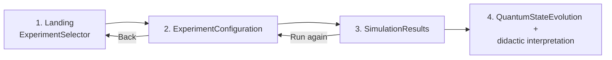
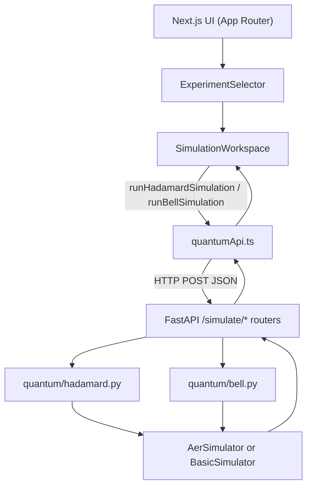

# Quantum Security Learning Simulator

> Interactive MVP for visualizing basic quantum computing concepts applied to information security.

Interactive educational platform for visualizing quantum computing concepts
applied to information security using Qiskit, Next.js and FastAPI.

This repository contains the prototype of a web platform developed for a
Master's Thesis (TFM) in Quantum Computing. It now exposes a modular
**experiment selector**: the user picks a quantum phenomenon (superposition,
entanglement, and two roadmap entries) and the platform runs the
corresponding circuit on a real Qiskit backend.

---

## MVP architecture (v2: Experiment Selector)

### Objective

To validate, end-to-end, the integration between a Next.js frontend, a
FastAPI backend and a Qiskit simulation engine through a *menu of
experiments*, each one configurable and didactically commented. The first
two experiments (Superposition and Entanglement) are fully functional; the
other two are advertised as the roadmap of the MVP.

### Application flow



### Architecture diagram (text)

```
User Interface (Next.js)
        ↓ REST API
FastAPI Backend
        ↓
Qiskit Simulation Engine
        ↓
Simulation Results
```

### Architecture diagram (visual)



### Available experiments

| Experiment                | Qubits | Backend status | Notes                                            |
| ------------------------- | ------ | -------------- | ------------------------------------------------ |
| Superposition             | 1      | Available      | Hadamard gate; `POST /simulate/hadamard`.        |
| Entanglement              | 2      | Available      | Bell state `\u03A6\u207A`; `POST /simulate/bell-state`. |
| Ideal vs Noisy Simulation | 1\u20132   | Coming soon    | Roadmap; UI tile is visible but disabled.        |
| Quantum Security Case     | 1\u20132   | Coming soon    | Roadmap; UI tile is visible but disabled.        |

### Screenshots

> Drop the corresponding PNGs in [docs/screenshots/](docs/screenshots/) to
> populate these placeholders. The filenames are referenced verbatim below.

- 
- 
- 

### Folder structure

```
TFM-Platform/
├── README.md
├── .gitignore
├── docs/
│   └── screenshots/                # PNG placeholders for the TFM report
├── frontend/                       # Next.js 16 + TS strict + Tailwind v4
│   ├── app/
│   │   ├── layout.tsx
│   │   ├── page.tsx                # state machine landing <-> workspace
│   │   └── globals.css
│   ├── components/ui/{Button,Card}.tsx
│   ├── features/quantum/
│   │   ├── data/experiments.ts     # static catalog (4 entries)
│   │   ├── services/quantumApi.ts  # runHadamard / runBell / generic runSimulation
│   │   ├── types.ts                # ExperimentType, QuantumExperiment, requests, result
│   │   └── components/
│   │       ├── ExperimentSelector.tsx
│   │       ├── ExperimentCard.tsx
│   │       ├── SimulationWorkspace.tsx
│   │       ├── ExperimentConfiguration.tsx
│   │       ├── QubitModeSelector.tsx
│   │       ├── SimulationForm.tsx
│   │       ├── BellSimulationForm.tsx
│   │       ├── SimulationResults.tsx
│   │       ├── ProbabilityBars.tsx
│   │       ├── CircuitDiagram.tsx
│   │       └── QuantumStateEvolution.tsx
│   └── lib/env.ts
└── backend/                        # FastAPI + Qiskit
    ├── app/
    │   ├── main.py                 # CORS + routers
    │   ├── api/{health,simulation}.py
    │   ├── schemas/simulation.py   # HadamardRequest, BellStateRequest, QuantumSimulationResult
    │   ├── services/simulation_service.py
    │   ├── quantum/{backend,hadamard,bell}.py
    │   └── core/{config,errors}.py
    ├── tests/{test_hadamard,test_bell}.py
    └── requirements.txt
```

### Implemented endpoints

| Method | Path                    | Purpose                                       |
| ------ | ----------------------- | --------------------------------------------- |
| GET    | `/health`               | Liveness probe.                               |
| POST   | `/simulate/hadamard`    | Single-qubit Hadamard experiment.             |
| POST   | `/simulate/bell-state`  | Two-qubit Bell state (`\u03A6\u207A` available). |

#### `POST /simulate/hadamard`

Request:

```json
{ "initial_state": "0", "shots": 1024 }
```

Response (`QuantumSimulationResult`):

```json
{
  "circuit": "hadamard",
  "initial_state": "0",
  "qubits": 1,
  "shots": 1024,
  "counts": { "0": 512, "1": 512 },
  "probabilities": { "0": 0.5, "1": 0.5 },
  "simulator": "aer_simulator",
  "execution_time_ms": 4.123
}
```

#### `POST /simulate/bell-state`

Request:

```json
{ "bell_state": "phi_plus", "shots": 1024 }
```

Response:

```json
{
  "circuit": "bell-state",
  "bell_state": "phi_plus",
  "qubits": 2,
  "shots": 1024,
  "counts": { "00": 512, "01": 0, "10": 0, "11": 512 },
  "probabilities": { "00": 0.5, "01": 0, "10": 0, "11": 0.5 },
  "simulator": "aer_simulator",
  "execution_time_ms": 5.842
}
```

### How to run

#### 1. Backend

```bash
cd backend
python3 -m venv .venv
source .venv/bin/activate
pip install -r requirements.txt
uvicorn app.main:app --reload --port 8000
```

- API root: <http://localhost:8000>
- Swagger UI: <http://localhost:8000/docs>

Run the test suite:

```bash
python -m pytest tests/ -v
```

#### 2. Frontend

```bash
cd frontend
npm install
cp .env.local.example .env.local
npm run dev
```

Open <http://localhost:3000>, pick an experiment, configure parameters and
click "Run simulation".

### Didactic background

- **Superposition.** A qubit can be in a linear combination of the
  computational basis states. The Hadamard gate is the canonical primitive
  to create an equal superposition from `|0⟩` or `|1⟩`. The MVP uses a
  single qubit because it isolates the concept in its minimal form.

- **Entanglement.** Two qubits become entangled when their joint state
  cannot be written as the product of individual qubit states. The
  Bell state `Φ⁺` is the simplest entangled state and is produced with
  exactly one Hadamard plus one CNOT. Measuring it yields only `|00⟩` or
  `|11⟩`, illustrating perfect correlation. The MVP uses two qubits because
  entanglement, by definition, cannot appear with fewer.

- **Why 1 and 2 qubits?** They are the smallest configurations that capture
  the two fundamental quantum phenomena needed to build the rest of the
  roadmap (noise comparison, Grover, Shor and security scenarios).

### Current limitations

- Only `Φ⁺` is implemented among the four Bell states.
- Ideal simulation only; no noise model is plugged in.
- No persistence and no authentication.
- CORS is open only to `http://localhost:3000` by default.

### Next steps (roadmap)

1. Remaining Bell states (`Φ⁻`, `Ψ⁺`, `Ψ⁻`).
2. Ideal vs Noisy comparison using `AerSimulator` noise models.
3. Pauli `X`/`Z` single-qubit baselines.
4. Grover search (small N).
5. Simplified Shor (period-finding on a small modulus).
6. Dedicated security module: BB84 QKD and a discussion of post-quantum
   cryptography.

Extension guides:

- [backend/EXTENDING.md](backend/EXTENDING.md)
- [frontend/EXTENDING.md](frontend/EXTENDING.md)

---

## Descripción académica del prototipo inicial

Este prototipo constituye la primera versión funcional del simulador
didáctico/interfaz desarrollado en el marco del Trabajo Fin de Máster sobre
computación cuántica aplicada a la seguridad de la información. Su finalidad
no es proporcionar una plataforma de producción, sino validar la viabilidad
técnica de la arquitectura propuesta integrando, de extremo a extremo, una
interfaz web interactiva (Next.js con TypeScript y Tailwind CSS), una API
REST construida con FastAPI y un motor de simulación cuántica basado en
Qiskit. La frontera entre capas se mantiene explícita: la interfaz no conoce
el motor cuántico, el motor cuántico no conoce HTTP, y el contrato entre
ambos se expresa mediante modelos Pydantic en el backend y tipos TypeScript
en el frontend, lo que asegura una comunicación tipada y auditable.

Desde el punto de vista arquitectónico, el prototipo se ha diseñado para
crecer sin necesidad de refactorizaciones disruptivas. La capa de simulación
cuántica está aislada como un paquete Python independiente, sin dependencias
de FastAPI, lo que permite ejecutarla en notebooks, en pruebas unitarias o
en futuras integraciones por línea de comandos. El modelo de respuesta
`QuantumSimulationResult` es genérico, de modo que los próximos circuitos
podrán reutilizar el contrato existente. El selector de simulador implementa
un mecanismo de degradación elegante (`AerSimulator` con respaldo en
`BasicSimulator`) que garantiza la ejecución del MVP incluso en entornos
donde la rueda binaria de `qiskit-aer` no esté disponible.

## Evolución del MVP respecto a la propuesta inicial

La primera iteración del prototipo se limitaba a una única simulación de la
puerta Hadamard sobre un qubit y exponía una sola pantalla con el formulario
asociado. En esta segunda iteración el prototipo se ha transformado en una
**plataforma modular**: la pantalla inicial es un selector de experimentos
en el que el usuario elige el fenómeno cuántico que desea explorar
—superposición o entrelazamiento— y, una vez seleccionado, accede a un
*workspace* dedicado donde configura los parámetros (estado inicial o Bell
state, número de *shots*) y observa los resultados.

Además de añadir un segundo experimento real (estado de Bell `Φ⁺` con
`H` + `CX` y medida sobre dos qubits), el frontend incorpora ahora un
componente de evolución del estado cuántico (`QuantumStateEvolution`) que
muestra paso a paso la transformación que sufre el sistema, así como
indicadores explícitos de qubits y del backend de simulación utilizado. En
el backend se ha generalizado el contrato de respuesta para incluir
metadatos opcionales (`qubits`, `simulator`, `execution_time_ms`) y se ha
añadido un endpoint `POST /simulate/bell-state` siguiendo el mismo patrón
de servicio y motor que el caso Hadamard.

El catálogo de experimentos también incluye, deliberadamente visibles pero
deshabilitadas, las dos próximas iteraciones del MVP (Ideal vs Noisy
Simulation y Quantum Security Case). Esto cumple un doble objetivo
académico: por un lado, informa al evaluador del recorrido planificado del
proyecto; por otro, demuestra que la arquitectura está preparada para
incorporar nuevos módulos sin reformas significativas, ya que basta con
añadir un motor en `backend/app/quantum/`, un schema y un endpoint, y un
formulario específico en `frontend/features/quantum/components/`.

---

## License

Academic use only.
