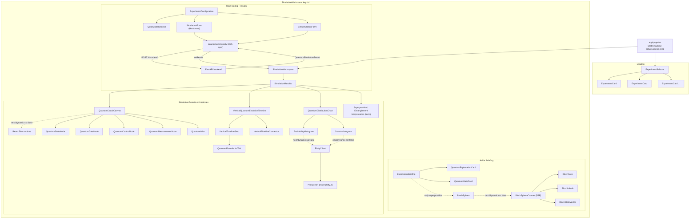
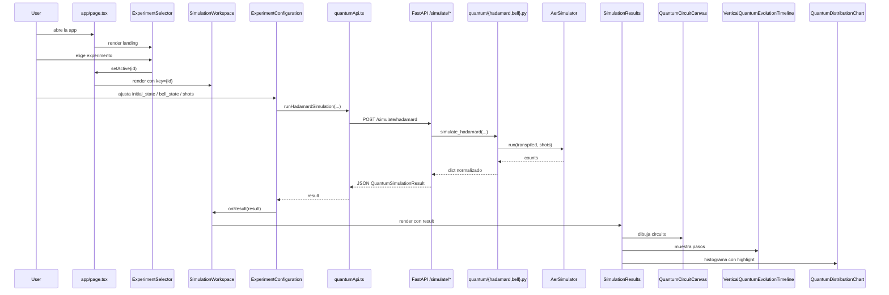

# Estado actual de la plataforma — Quantum Security Learning Simulator

> Documento técnico + funcional. Refleja el estado del repositorio a **14 de
> mayo de 2026**, tras la segunda iteración del MVP (selector de
> experimentos) y las cinco fases visuales aplicadas sobre el frontend
> (circuito React Flow, esfera de Bloch, timeline vertical, charts Plotly y
> design system cuántico).

---

## 1. Visión general

El proyecto es una **plataforma educativa interactiva** que ilustra
conceptos básicos de computación cuántica aplicados a la seguridad de la
información. Está construida como un MVP de TFM con tres capas claramente
desacopladas:

```
Next.js 16 (App Router + TS strict + Tailwind v4)
        ↓  HTTP REST + tipado compartido
FastAPI + Pydantic v2
        ↓  llamadas Python puras
Motor cuántico Qiskit (AerSimulator → BasicSimulator como fallback)
```

La frontera entre capas se mantiene explícita: la interfaz no conoce el
motor cuántico, el motor no conoce HTTP y el contrato se expresa con
modelos Pydantic en backend y tipos TypeScript en frontend. Esto facilita
auditoría, testing y la evolución futura sin refactor disruptivo.

### Estado funcional actual

| Bloque | Estado |
|---|---|
| Selector de experimentos (4 entradas) | Implementado |
| Experimento Superposición (Hadamard, 1 qubit) | Funcional, end-to-end |
| Experimento Entrelazamiento (Bell `Φ⁺`, 2 qubits) | Funcional, end-to-end |
| Ideal vs Noisy Simulation | Coming-soon (visible, deshabilitado) |
| Quantum Security Case | Coming-soon (visible, deshabilitado) |
| Diagrama de circuito visual (React Flow) | Implementado |
| Esfera de Bloch 3D (React Three Fiber) | Implementado (modo Superposición) |
| Charts Plotly (probabilidades + counts) | Implementado con tabs |
| Timeline de evolución de estado | Implementado en versión vertical |
| Modo `visualMode="simple"` (fallback texto/SVG) | Conservado |

---

## 2. Stack y dependencias

### Backend

- **Python 3.9+** (3.11+ recomendado).
- **FastAPI** — capa HTTP, routers y CORS.
- **Pydantic v2** — modelos de request/response (`model_config = ConfigDict(extra="forbid")`).
- **Qiskit** — construcción y ejecución de circuitos.
- **qiskit-aer** — `AerSimulator` por defecto; si no se puede instalar, el
  backend cae automáticamente a `BasicSimulator` (puro Python, viene con
  Qiskit core). Esta degradación elegante está documentada en
  `app/quantum/backend.py`.

### Frontend (`frontend/package.json`)

| Dependencia | Versión | Rol |
|---|---|---|
| `next` | 16.2.6 | App Router, SSR/SSG, Turbopack |
| `react` / `react-dom` | 19.2.4 | UI + features de React 19 (useSyncExternalStore, etc.) |
| `typescript` | ^5 | Strict mode |
| `tailwindcss` + `@tailwindcss/postcss` | ^4 | Estilos con `@theme inline` |
| `framer-motion` | ^12.38.0 | Animaciones (timeline, transiciones, AnimatePresence) |
| `katex` + `react-katex` | ^0.16.45 / ^3.1.0 | Renderizado de fórmulas matemáticas |
| `@xyflow/react` | ^12.10.2 | Diagrama visual del circuito (React Flow) |
| `three` + `@react-three/fiber` + `@react-three/drei` | ^0.184 / ^9 / ^10 | Esfera de Bloch 3D |
| `plotly.js-cartesian-dist-min` + `react-plotly.js` | ^3.5.1 / ^2.6.0 | Histogramas interactivos |

Todas las librerías pesadas (R3F, React Flow, Plotly) se importan vía
`next/dynamic` con `ssr: false` y skeleton de carga para mantener el TTI
bajo y el SSR funcionando.

---

## 3. Arquitectura backend (`backend/app/`)

```
backend/app/
├── main.py                    FastAPI factory: CORS + routers + handlers
├── api/
│   ├── health.py              GET  /health
│   └── simulation.py          POST /simulate/hadamard
│                              POST /simulate/bell-state
├── schemas/
│   └── simulation.py          HadamardRequest, BellStateRequest,
│                              QuantumSimulationResult
├── services/
│   └── simulation_service.py  Orquestación (request → engine → dict)
├── quantum/
│   ├── backend.py             Selector AerSimulator | BasicSimulator
│   ├── hadamard.py            simulate_hadamard(initial_state, shots)
│   └── bell.py                simulate_bell_state(bell_state, shots)
└── core/
    ├── config.py              Settings (CORS, service name)
    └── errors.py              SimulationError + exception handlers
```

### Contrato HTTP

#### `GET /health`
```json
{ "status": "ok", "service": "quantum-simulator-api" }
```

#### `POST /simulate/hadamard`
Request:
```json
{ "initial_state": "0", "shots": 1024 }
```
- `initial_state` ∈ `{"0", "1"}`.
- `shots` ∈ `[1, 100000]`.

#### `POST /simulate/bell-state`
Request:
```json
{ "bell_state": "phi_plus", "shots": 1024 }
```
- `bell_state` solo acepta `"phi_plus"` (los otros tres están en
  roadmap visible como coming-soon en el UI).
- `shots` ∈ `[1, 100000]`.

#### Respuesta común — `QuantumSimulationResult`
```json
{
  "circuit": "bell-state",
  "bell_state": "phi_plus",
  "qubits": 2,
  "shots": 1024,
  "counts": { "00": 512, "01": 0, "10": 0, "11": 512 },
  "probabilities": { "00": 0.5, "01": 0, "10": 0, "11": 0.5 },
  "simulator": "aer_simulator",
  "execution_time_ms": 5.842
}
```

Decisiones notables:
- `counts` y `probabilities` son `dict[str, int]` / `dict[str, float]`
  abiertos: soporta 1 qubit (`"0"`/`"1"`) y 2 qubits
  (`"00"`/`"01"`/`"10"`/`"11"`) sin cambios en el contrato.
- `initial_state` y `bell_state` son opcionales (`Optional`) para acomodar
  ambos tipos de experimento.
- Las claves siempre se normalizan (incluso cuando Qiskit devuelve
  conteos cero), para que el frontend pueda renderizar histogramas
  consistentes.

### Motor cuántico

**Hadamard** (`backend/app/quantum/hadamard.py`):
1. `QuantumCircuit(1, 1)`.
2. Si `initial_state == "1"` → aplicar `X` para preparar `|1⟩`.
3. Aplicar `H` (Hadamard).
4. Medir.
5. `transpile` + ejecutar.
6. Normalizar counts a `{"0": …, "1": …}`.
7. Calcular probabilidades = counts / shots.

**Bell** (`backend/app/quantum/bell.py`):
1. `QuantumCircuit(2, 2)`.
2. `H` sobre q0, `CX(0, 1)`, medir ambos.
3. Producir `Φ⁺ = (|00⟩ + |11⟩) / √2`.
4. Normalizar counts a `{"00", "01", "10", "11"}`.

**Selector de simulador** (`backend/app/quantum/backend.py`):
1. Intenta `from qiskit_aer import AerSimulator` → lo usa si está disponible.
2. Si `ImportError` → cae a `qiskit.providers.basic_provider.BasicSimulator`.

Esto garantiza ejecución del MVP incluso en plataformas donde la rueda
binaria de `qiskit-aer` no se pueda instalar (p. ej. arquitecturas exóticas).

---

## 4. Arquitectura frontend (`frontend/`)

### Estructura general

```
frontend/
├── app/
│   ├── layout.tsx                 Metadata, fuentes Geist
│   ├── page.tsx                   State machine landing ↔ workspace
│   └── globals.css                Tailwind v4 entry + variables CSS
├── components/
│   ├── ui/                        Button, Card
│   └── quantum/
│       ├── QuantumFormula.tsx     Wrapper centralizado de KaTeX
│       ├── QuantumGateCard.tsx
│       ├── QuantumExplanationCard.tsx
│       ├── animation/
│       │   ├── VerticalQuantumEvolutionTimeline.tsx
│       │   ├── VerticalTimelineStep.tsx
│       │   └── VerticalTimelineConnector.tsx
│       ├── bloch/
│       │   ├── BlochSphere.tsx              (SSR-safe wrapper)
│       │   ├── BlochSphereCanvas.tsx         (R3F)
│       │   ├── BlochAxes.tsx
│       │   ├── BlochLabels.tsx
│       │   ├── BlochStateVector.tsx
│       │   ├── BlochAnimationController.tsx (hook de animación)
│       │   ├── BlochFallback.tsx             (SVG no-WebGL)
│       │   └── blochMath.ts                  (helpers puros, ket→vector)
│       ├── charts/
│       │   ├── QuantumDistributionChart.tsx  (tabs probabilities/counts)
│       │   ├── ProbabilityHistogram.tsx
│       │   ├── CountsHistogram.tsx
│       │   ├── PlotlyClient.tsx              (SSR-safe wrapper)
│       │   ├── PlotlyChart.tsx
│       │   ├── chartTheme.ts
│       │   ├── useColorScheme.ts             (light/dark via useSyncExternalStore)
│       │   └── plotly-cartesian.d.ts         (shim TS)
│       └── circuit/
│           ├── QuantumCircuitCanvas.tsx      (React Flow root)
│           ├── QuantumCircuitLegend.tsx
│           ├── QuantumStateNode.tsx
│           ├── QuantumGateNode.tsx
│           ├── QuantumControlNode.tsx        (control + target)
│           ├── QuantumMeasurementNode.tsx
│           ├── QuantumWire.tsx               (edge)
│           └── wireBuilders.ts               (pure graph builders)
├── features/
│   └── quantum/
│       ├── types.ts                          (mirror del contrato backend)
│       ├── data/
│       │   ├── experiments.ts                (catálogo de 4 experimentos)
│       │   ├── experimentContent.ts          (copy didáctico)
│       │   └── evolution.ts                  (steps por experimento)
│       ├── services/
│       │   └── quantumApi.ts                 (única capa que llama a fetch)
│       └── components/
│           ├── ExperimentSelector.tsx        (landing grid)
│           ├── ExperimentCard.tsx
│           ├── SimulationWorkspace.tsx       (pantalla por experimento)
│           ├── ExperimentBriefing.tsx        (panel didáctico)
│           ├── ExperimentConfiguration.tsx
│           ├── QubitModeSelector.tsx
│           ├── SimulationForm.tsx            (Hadamard)
│           ├── BellSimulationForm.tsx
│           ├── SimulationResults.tsx         (orquesta circuit/chart/timeline)
│           ├── ProbabilityBars.tsx           (fallback SVG simple)
│           ├── CircuitDiagram.tsx            (fallback SVG simple)
│           └── QuantumStateEvolution.tsx     (fallback list simple)
├── styles/
│   └── quantum-theme.ts                      (tokens TS para JS consumers)
└── lib/
    └── env.ts                                (NEXT_PUBLIC_QUANTUM_API_URL)
```

### Reglas arquitectónicas

1. **Solo `services/quantumApi.ts` hace `fetch`.** Los componentes nunca
   hablan directamente con el backend.
2. **El tipo `QuantumSimulationResult` es espejo del contrato Pydantic.**
   Genérico para soportar cualquier número de qubits.
3. **`lib/env.ts` valida la URL del backend al cargar el módulo** (fail-fast
   si falta `NEXT_PUBLIC_QUANTUM_API_URL`).
4. **Componentes pesados (Bloch, Plotly, React Flow) son SSR-safe** vía
   `next/dynamic({ ssr: false })` con loading skeleton.
5. **`visualMode="simple"` se preserva** como ruta de fallback texto/SVG
   ligero (útil para imprimir el TFM, lectores de pantalla, navegadores
   sin WebGL).

### Diagrama de componentes (alto nivel)

El siguiente diagrama muestra cómo se compone el árbol de la UI desde
`app/page.tsx` hasta los subsistemas visuales, dónde está la frontera
HTTP y qué tres bloques se cargan dinámicamente (SSR-safe boundary).



| Nodo del diagrama | Rol |
|---|---|
| `app/page.tsx` | Entry point; `useState<ExperimentType \| null>` decide landing vs workspace. No hace `fetch`. |
| `quantumApi.ts` | Única capa que habla HTTP con el backend. Cualquier componente que necesite datos pasa por aquí. |
| `SimulationResults` | Orquesta los tres subsistemas visuales según `visualMode` (`"advanced"` por defecto, `"simple"` como fallback). |
| `BlochSphere`, `PlotlyClient`, `QuantumCircuitCanvas` | Cargados con `next/dynamic({ ssr: false })` con skeleton de carga, para mantener SSR limpio y el bundle inicial pequeño. |
| `QuantumFormula` | Wrapper centralizado de KaTeX (props `size`, `compact`, `displayMode`). Único punto donde se importa `react-katex`. |

Las flechas punteadas (`-.->`) marcan los puntos donde el grafo cruza la
frontera dinámica de carga; las flechas continuas (`-->`) son
composición React directa.

---

## 5. Flujo de uso (end-to-end)



### State machine de `app/page.tsx`

`page.tsx` mantiene un único `activeExperimentId: ExperimentType | null`:

- `null` → renderiza `<ExperimentSelector>` (landing).
- otherwise → renderiza `<SimulationWorkspace key={id} experiment={...} onBack={...}>`.

El `key` fuerza un remount completo al cambiar de experimento, lo que
elimina la necesidad de `useEffect` de reseteo en hijos.

---

## 6. Subsistemas visuales

### 6.1 Circuit visual — React Flow (`components/quantum/circuit/`)

- Construido sobre `@xyflow/react@12`.
- `wireBuilders.ts` produce los grafos (`nodes`, `edges`) para Hadamard
  y Bell como funciones puras, sin React. Cada nodo es un tipo
  discriminado del union `QuantumNode`:
  - `quantumState`: estados iniciales `|0⟩`, `|1⟩`.
  - `quantumGate`: H, X, etc.
  - `quantumControl` / `quantumTarget`: control + target del CX.
  - `quantumMeasurement`: símbolo de medida.
- Los nodos no son arrastrables, el viewport está bloqueado (`fitView`,
  `panOnDrag={false}`, `zoomOnScroll={false}`). El canvas se comporta como
  una figura inline, no como un editor.
- `data-running="true"` + `boxShadow: var(--glow-quantum-violet)` cuando
  hay una simulación en vuelo (efecto sutil de "circuito activo").
- `CircuitDiagram` (SVG simple) se conserva como fallback cuando
  `visualMode === "simple"`.

### 6.2 Bloch sphere — React Three Fiber (`components/quantum/bloch/`)

- `BlochSphere` (público) carga `BlochSphereCanvas` con `next/dynamic({ ssr: false })`.
- `blochMath.ts` traduce kets `0/1/+/-` a vectores 3D unitarios y aplica
  secuencias de gates (`H`, `X`) sin tocar three.js — útil para tests.
- `BlochAxes` dibuja la esfera + ejes; usa constantes de `quantum-theme.ts`.
- `BlochStateVector` renderiza el vector animado entre origen → target.
- `BlochAnimationController` es un hook (`useBlochAnimation`) que usa
  `useFrame` para interpolar suavemente entre `source` y `target`.
- `BlochFallback` es un SVG estático para entornos sin WebGL o durante
  la carga del bundle dinámico.
- Solo se renderiza para el experimento **Superposición**: el `useMemo`
  en `SimulationWorkspace.tsx` decide los gates aplicados (`["H"]` si
  el estado inicial es `|0⟩`, `["X", "H"]` si es `|1⟩`).

### 6.3 Charts — Plotly (`components/quantum/charts/`)

- Bundle elegido: `plotly.js-cartesian-dist-min` (solo 2D, ~700 kB
  gzipped vs ~3 MB del bundle completo). Las types vienen de
  `@types/plotly.js` y un shim local `plotly-cartesian.d.ts`.
- `PlotlyClient.tsx` envuelve `PlotlyChart` con `next/dynamic({ ssr: false })`
  y skeleton de carga.
- `QuantumDistributionChart` es un compuesto con tabs:
  - **Probabilities**: barras 0–1, eje Y porcentual.
  - **Counts**: barras enteras hasta `shots`.
- `useColorScheme` (React 19, `useSyncExternalStore`) detecta el esquema
  light/dark del SO y selecciona la paleta apropiada del `chartTheme`.
- Las paletas leen de `quantum-theme.ts` para que el sistema de diseño
  sea coherente entre Plotly y el resto del UI.
- `highlight` es un `ReadonlySet<string>` con los estados a resaltar; en
  Bell se pasa `{"00", "11"}` para subrayar los outcomes esperados de
  `Φ⁺` y oscurecer `|01⟩` y `|10⟩` como "estados imposibles".

### 6.4 Timeline vertical (`components/quantum/animation/`)

Tras dos iteraciones (horizontal con cards, horizontal con grid, vertical
final), el diseño actual es **siempre vertical**:

- `VerticalQuantumEvolutionTimeline` orquesta. Card contenedora con
  **spine gradient cyan → violet → fuchsia** pegado al borde izquierdo
  como riel visual.
- `VerticalTimelineStep` por cada paso: badge circular numerado coloreado
  por `kind` + header uppercase `Step N — Label` + fórmula KaTeX en
  bloque centrado + descripción didáctica opcional. Animación
  `motion.div` con stagger 80 ms y respeto a `prefers-reduced-motion`
  vía `useReducedMotion()`.
- `VerticalTimelineConnector` entre pasos: chevron 14 px + texto
  uppercase con la operación que produce el siguiente estado
  (`Apply H`, `Apply CX(q0, q1)`, `Measurement`...).
- **Cero overflow horizontal en el contenedor**. Si una fórmula es muy
  ancha, solo la fórmula scrollea internamente (`overflow-x-auto` en
  el `<div>` de `displayMode="block"` de `QuantumFormula`).
- Responsive: padding `p-3 sm:p-4 sm:pl-5`, sin cambiar la orientación
  entre mobile y desktop.

### 6.5 Sistema de diseño cuántico

Dos fuentes de verdad mantenidas en paralelo:

**`frontend/app/globals.css`** — variables CSS y `@theme inline` Tailwind v4:
```css
:root {
  --color-quantum-cyan: #22d3ee;
  --color-quantum-violet: #7c3aed;
  --color-state-active: var(--color-quantum-cyan);
  --color-state-superposition: var(--color-quantum-violet);
  --color-state-entangled: #c026d3;
  --color-state-impossible: rgba(148, 163, 184, 0.45);
  --color-state-measured: #0f172a;
  --shadow-quantum-card: 0 10px 30px -20px rgba(15, 23, 42, 0.35);
  --glow-quantum-cyan: 0 0 28px -8px rgba(34, 211, 238, 0.55);
  --glow-quantum-violet: 0 0 28px -8px rgba(124, 58, 237, 0.55);
  --glow-quantum-entangled: 0 0 24px -6px rgba(192, 38, 211, 0.55);
  --quantum-wire-color: var(--color-quantum-gray-soft);
}
```
Con override completo en `@media (prefers-color-scheme: dark)`.

**`frontend/styles/quantum-theme.ts`** — espejo TS para consumers JS
(Framer, Plotly, three.js):
```ts
export const QUANTUM_COLORS = { quantumCyan: "#22d3ee", quantumViolet: "#7c3aed", ... };
export const QUANTUM_STATE_COLORS = {
  active: { base: ..., dim: ... },
  superposition: { base: ..., dim: ... },
  entangled: { base: ..., dim: ... },
  impossible: { base: ..., dim: ... },
  measured: { base: ..., dim: ... },
};
export const QUANTUM_SHADOWS = { ... };
export const QUANTUM_GLOW = { ... };
export const QUANTUM_MOTION = { duration: { fast: 0.22, standard: 0.32, slow: 0.6 }, easing: { ... }, stagger: 0.12 };
export const QUANTUM_SPACING = { ... };
```

Convención semántica:
- **cyan** = active / measurement-friendly.
- **violet** = superposition / state-in-flight.
- **fuchsia** (`#c026d3`) = entangled / Bell-state-final.
- **slate gris translúcido** = impossible (Bell `|01⟩`, `|10⟩`).

Una utilidad adicional `.quantum-thin-scroll` en `globals.css` da
scrollbars finos coherentes (4 px de alto, thumb gris translúcido, hover
violeta) para los viewports internos de fórmulas y charts.

---

## 7. Lo que ya está hecho — fases recorridas

### Fase 1: visual quantum circuit renderer (React Flow)

- `wireBuilders.ts` con funciones puras `buildHadamardGraph` y
  `buildBellGraph` produciendo `nodes` + `edges`.
- Cinco nodos custom: `QuantumStateNode`, `QuantumGateNode`,
  `QuantumControlNode` / `QuantumTargetNode`, `QuantumMeasurementNode`.
- Una `QuantumWire` (edge) custom usando `--quantum-wire-color`.
- `QuantumCircuitCanvas` envuelve `<ReactFlow>` con `ReactFlowProvider`,
  bloquea pan/zoom, aplica `fitView`, y muestra `QuantumCircuitLegend`
  desplegable debajo.
- `data-running="true"` + box-shadow violeta durante la ejecución.

### Fase 2: interactive Bloch sphere (three.js / R3F)

- `blochMath.ts` puro: `SupportedKet`, `SingleQubitGate`, `BlochVector`,
  `ketToVector`, `applyGates`, `lerpVector`.
- `BlochSphereCanvas` con `<Canvas>` de R3F: esfera semi-transparente,
  ejes XYZ, labels `|0⟩`/`|1⟩`/`|+⟩`/`|−⟩` via `@react-three/drei`,
  vector animado con flecha cónica y `OrbitControls` (solo rotación).
- `useBlochAnimation` (custom hook con `useFrame`) interpola con
  ease-out entre estado inicial y target a lo largo de ~600 ms.
- `BlochFallback` SVG para entornos sin WebGL (detección via
  `detectWebGl()` en init lazy).
- `BlochSphere` se inyecta en `ExperimentBriefing` solo cuando
  `experiment.id === "superposition"`.

### Fase 3: quantum state animation engine (Framer Motion)

- Iteración 1: timeline horizontal con cards (problemas de overflow con
  fórmulas largas).
- Iteración 2: grid responsivo `minmax(140px, 220px)` (overflow
  controlado, pero seguía cortando cards en paneles estrechos).
- Iteración 3 final: **timeline vertical compacto**. Tres componentes
  pequeños (`VerticalQuantumEvolutionTimeline`,
  `VerticalTimelineStep`, `VerticalTimelineConnector`), data compartida
  con el modo simple, animación con stagger y `useReducedMotion`.
- `EvolutionStep` extendido con `description?`, `operationFromPrevious?`,
  `kind: "initial" | "operation" | "state" | "measurement"`.

### Fase 4: advanced probabilities visualization (Plotly)

- Bundle `plotly.js-cartesian-dist-min` para reducir peso.
- `ProbabilityHistogram` + `CountsHistogram` independientes, ambos
  alimentados por el mismo result.
- `QuantumDistributionChart` con tabs accesibles (`role="tablist"`,
  `aria-selected`).
- `chartTheme.ts` con paletas light/dark derivadas de
  `quantum-theme.ts`. Hover azul cyan, barras imposibles en gris
  translúcido, highlight cyan vivo para los outcomes esperados de Bell.
- `useColorScheme` (React 19) detecta y propaga el modo OS para que los
  charts respondan al tema sin refrescos.

### Fase 5: quantum visual design system

- Variables CSS en `globals.css` + `@theme inline` Tailwind v4.
- Espejo TS en `frontend/styles/quantum-theme.ts`.
- Adopción consistente en `BlochAxes`, `BlochStateVector`, `chartTheme`,
  y los borders/glows de cards/timeline.
- Convención semántica documentada (cyan=active, violet=superposition,
  fuchsia=entangled, slate=impossible, neutral=measured).

### Mejoras transversales (post-fases)

- `QuantumFormula` extendido con `size: "sm" | "md" | "lg"`, `compact?`
  y scroll horizontal interno (`quantum-thin-scroll`) en modo bloque.
- Timeline horizontal refactor → eliminado → reemplazado por vertical
  tras feedback de UX (overflow en Bell, cards demasiado anchas).
- `ExperimentBriefing` acepta `physicalVisualization?: ReactNode`
  inyectable (donde se monta la Bloch sphere para Superposición).
- `SimulationResults` orquesta condicionalmente según `visualMode` y
  recibe `isRunning` para propagar el glow de "circuito en vuelo".

---

## 8. Datos y catálogo

### `features/quantum/data/experiments.ts`

Catálogo estático de 4 experimentos:

| id | título | qubits | estado |
|---|---|---|---|
| `superposition` | Single-qubit superposition | 1 | available |
| `entanglement` | Two-qubit entanglement (Bell `Φ⁺`) | 2 | available |
| `ideal-vs-noise` | Ideal vs Noisy simulation | 1–2 | coming-soon |
| `security-case` | Quantum security case | 1–2 | coming-soon |

### `features/quantum/data/evolution.ts`

Builders puros que producen los pasos de evolución por experimento:

```ts
export interface EvolutionStep {
  id: string;
  label: string;
  expression: string;            // KaTeX
  description?: string;          // narrativa didáctica
  operationFromPrevious?: string;// "Apply H on q0", "Measurement"...
  kind: "initial" | "operation" | "state" | "measurement";
}
```

- `buildSuperpositionSteps(initialState)` → 3 pasos.
- `buildEntanglementSteps()` → 4 pasos.
- `buildEvolutionSteps(experimentId, initialState)` → dispatcher
  genérico, devuelve `null` si el experimento aún no documenta su
  evolución.

Estos datos alimentan tanto el timeline vertical (`visualMode="advanced"`)
como el legacy `QuantumStateEvolution` (`visualMode="simple"`).

### `features/quantum/data/experimentContent.ts`

Copy didáctico (gates, explicación, lecturas) consumido por
`ExperimentBriefing`.

---

## 9. Performance y SSR

- **Bundle splitting**: las librerías pesadas (Plotly, three.js, React
  Flow) están detrás de `next/dynamic({ ssr: false })`. El primer paint
  no las carga; aparecen tras la hidratación con un skeleton.
- **Static generation**: la app entera se prerenderiza como `○ Static`
  (`app/page.tsx` no llama a servicios en SSR). El build produce 4
  páginas estáticas (`/`, `/_not-found`, etc.).
- **Lazy initialization** en estados sensibles a SSR:
  `useState(() => detectWebGl())` (Bloch), evitando setState dentro de
  `useEffect`.
- **`useSyncExternalStore`** para integrar `matchMedia` (esquema de
  color) con React 19 y SSR.
- **Tiempo de build** (`npm run build`): ~5 s con Turbopack.
- **Lint + tsc** ambos en verde en la rama actual.

---

## 10. Cómo ejecutar

### Backend
```bash
cd backend
python3 -m venv .venv
source .venv/bin/activate
pip install -r requirements.txt
uvicorn app.main:app --reload --port 8000
```
- API: <http://localhost:8000>
- Swagger: <http://localhost:8000/docs>
- Tests: `python -m pytest tests/ -v`

### Frontend
```bash
cd frontend
npm install
cp .env.local.example .env.local   # editar si el backend no está en :8000
npm run dev
```
- UI: <http://localhost:3000>
- Lint: `npm run lint`
- Type-check: `npx tsc --noEmit`
- Build: `npm run build`

---

## 11. Limitaciones actuales

- Solo `Φ⁺` implementado entre los cuatro estados de Bell.
- Sin modelo de ruido aún (`AerSimulator` ideal).
- Sin persistencia ni autenticación.
- CORS abierto solo a `http://localhost:3000` por defecto.
- La esfera de Bloch solo se muestra en el experimento Superposición
  (no hay representación 3D del entrelazamiento todavía).
- Tooltips / glosario interactivo todavía no añadidos (Fase 6 diferida).

---

## 12. Roadmap

### Roadmap de fases visuales pendientes

| Fase | Descripción | Estado |
|---|---|---|
| 6 | Overlays educativos (tooltips Radix, glosario, hint sobre cada gate) | Hecha (2026-05-27) |
| 7 | Comparación ideal vs ruidoso (`NoiseModel` de qiskit-aer) | Pendiente, requiere extensión de contrato backend |
| 8 | UX polish (loaders, transiciones de pantalla, responsive fino) | Parcial (loaders ya están) |
| 9 | Documentación + arquitectura final en `README.md` | Pendiente |
| 10 | Checklist de validación final | Pendiente |

### Roadmap de experimentos

1. Resto de estados de Bell (`Φ⁻`, `Ψ⁺`, `Ψ⁻`) — extender literal +
   engine + UI form.
2. Single-qubit baseline con `X` y `Z` puros para contraste con `H`.
3. Comparación ideal vs ruidoso con `AerSimulator` + `NoiseModel`
   (cambio de contrato: response añadirá una segunda distribución).
4. Algoritmo de Grover (N pequeño) — primer algoritmo no-trivial.
5. Versión simplificada de Shor (period-finding sobre módulo pequeño).
6. Módulo de seguridad: QKD BB84 + discusión sobre criptografía
   post-cuántica.

---

## 13. Riesgos técnicos a tener presentes

- **Tamaño del bundle**: Plotly + three.js + React Flow ya pesan ~1.5 MB
  combinados (lazy-loaded, pero conviene auditar con
  `next build --profile` antes de añadir más libs visuales).
- **`AerSimulator` en CI**: la rueda binaria puede no estar disponible
  en ciertos runners; el fallback a `BasicSimulator` cubre la
  funcionalidad pero conviene asegurar que los tests aceptan ambos
  `simulator` en el response.
- **Versionado de Qiskit**: la API de Qiskit ha cambiado entre 0.x y
  1.x; el código usa imports estables (`from qiskit import QuantumCircuit`,
  `from qiskit_aer import AerSimulator`). Cualquier upgrade mayor
  requiere revisar `transpile()` y la API de results.
- **Comportamiento de `prefers-reduced-motion`**: el timeline ya lo
  respeta, pero futuras animaciones (Bloch, tooltips) deben heredar la
  misma convención para mantener accesibilidad.
- **Anchura de fórmulas Bell muy largas** (`|00⟩+|11⟩ (correlated)`): se
  resuelve con scroll interno; si en el futuro se añaden expresiones
  aún más largas (p. ej. Φ⁻ con signos), puede ser necesario un
  `wrapper white-space: nowrap` adicional o un tamaño menor.

---

## 14. Validación actual

| Comprobación | Comando | Estado |
|---|---|---|
| ESLint | `npm run lint` | 0 errores |
| TypeScript strict | `npx tsc --noEmit` | 0 errores |
| Build de producción | `npm run build` | OK, ~5 s |
| Backend tests | `python -m pytest tests/ -v` | Verde |

---

## 15. Decisiones de diseño relevantes para la memoria del TFM

1. **Separación de capas explícita**. La capa de simulación cuántica
   (`backend/app/quantum/`) no importa FastAPI ni Pydantic; se puede
   ejecutar desde notebooks o scripts CLI sin la HTTP layer.
2. **Contrato de respuesta genérico**. `QuantumSimulationResult`
   funciona para cualquier número de qubits, lo que permite añadir
   experimentos sin migrar el frontend.
3. **Selector de simulador con degradación elegante**. La aplicación
   siempre arranca, incluso si `qiskit-aer` no se puede instalar.
4. **Fallback `visualMode="simple"`**. Mantenemos una ruta de render
   minimalista (texto + SVG) compatible con impresión, lectores de
   pantalla y entornos restringidos.
5. **Componentes presentacionales puros**. `QuantumCircuitCanvas`,
   `BlochSphere`, `QuantumDistributionChart` y la timeline reciben
   props inmutables; no consultan red ni almacenan estado de negocio.
6. **Dos fuentes paralelas del design system**: CSS variables +
   `quantum-theme.ts`. Documentado y trazable (cada cambio en uno
   exige el reflejo en el otro).
7. **React 19 nativo**: `useSyncExternalStore`, lazy init de `useState`,
   `useReducedMotion`. Sin parches retrocompatibles.

---

## 16. Glosario de términos cuánticos

Glosario didáctico ordenado **por categoría**, no alfabético, pensado
para acompañar la lectura del TFM y servir de base a la futura Fase 6
(tooltips Radix + glosario interactivo en la UI). Cada entrada incluye
una definición breve y, cuando aplica, una referencia al archivo del
repositorio donde aparece materializado.

### 16.1. Estados y notación

- **Qubit**. Unidad básica de información cuántica. A diferencia del
  bit clásico, puede estar en superposición de `|0>` y `|1>`.
- **Ket `|x>`**. Notación de Dirac para un vector columna que
  representa un estado cuántico. Por convención `|0> = (1,0)^T`,
  `|1> = (0,1)^T`.
- **Bra `<x|`**. Vector fila conjugado transpuesto del ket; permite
  expresar productos internos `<x|y>` y proyecciones.
- **Base computacional `|0>`/`|1>`**. Base ortonormal canónica usada
  por toda la plataforma para definir estados iniciales y resultados
  de medida.
- **Superposición**. Combinación lineal de estados base
  `α|0> + β|1>` con `|α|^2 + |β|^2 = 1`. Materializada en el
  experimento Hadamard.
- **Amplitud**. Coeficiente complejo `α`, `β` (en general `c_i`) que
  multiplica cada vector base. No es directamente observable; lo
  observable es `|c_i|^2`.
- **Normalización**. Restricción `Σ |c_i|^2 = 1` que garantiza que
  las probabilidades de medida sumen 1.

### 16.2. Puertas cuánticas

- **Puerta (gate)**. Operación unitaria que evoluciona un estado
  cuántico. Reversible por construcción.
- **Unitaria**. Matriz `U` tal que `U†U = I`. Conserva la norma del
  estado.
- **Hadamard (H)**. Puerta canónica de superposición:
  `H|0> = (|0>+|1>)/√2`, `H|1> = (|0>-|1>)/√2`. Implementada en
  [`backend/app/quantum/hadamard.py`](../backend/app/quantum/hadamard.py).
- **Pauli X / Y / Z**. Puertas de un qubit. `X` es el NOT cuántico,
  `Z` aplica fase `-1` sobre `|1>`, `Y = iXZ`.
- **Identidad I**. No modifica el estado; útil como puerta "vacía" en
  el render del circuito.
- **Fase S / T**. Puertas diagonales que rotan la fase relativa
  (`S = diag(1, i)`, `T = diag(1, e^{iπ/4})`).
- **Control + target**. En puertas controladas, el qubit de control
  decide si se aplica la operación sobre el qubit destino. Representado
  visualmente como `QuantumControlNode` (punto sólido) + edge hasta el
  target.
- **CNOT / CX**. Puerta controlada-NOT de dos qubits. Pieza central del
  protocolo Bell. Implementada en
  [`backend/app/quantum/bell.py`](../backend/app/quantum/bell.py).

### 16.3. Sistemas multi-qubit

- **Producto tensorial `⊗`**. Operación que combina espacios de
  Hilbert. Un registro de `n` qubits vive en `(ℂ²)^{⊗n}`, de
  dimensión `2^n`.
- **Registro cuántico**. Conjunto ordenado de qubits tratados como un
  sistema único. En Qiskit, `QuantumRegister(n)`.
- **Entrelazamiento (entanglement)**. Correlación cuántica entre dos
  o más qubits que no admite descomposición como producto tensorial
  de estados individuales. Materializado en el experimento Bell.
- **Estados de Bell `Φ+`, `Φ-`, `Ψ+`, `Ψ-`**. Cuatro estados
  máximamente entrelazados de dos qubits. Forman una base ortonormal
  del espacio de 2 qubits.
  - `Φ+ = (|00> + |11>)/√2`
  - `Φ- = (|00> − |11>)/√2`
  - `Ψ+ = (|01> + |10>)/√2`
  - `Ψ- = (|01> − |10>)/√2`

### 16.4. Medida y resultados

- **Medida en base computacional**. Proyección del estado sobre los
  vectores `|i>` de la base canónica. Es la única medida que la
  plataforma expone al usuario.
- **Colapso de la función de onda**. Tras la medida, el estado se
  reduce al autoestado observado; la información cuántica restante se
  pierde.
- **Probabilidad de medida**. `P(i) = |c_i|^2`. La plataforma la
  reporta como vector `probabilities`.
- **Shots**. Número de repeticiones independientes del experimento.
  Configurable desde `SimulationForm` / `BellSimulationForm`.
- **Counts**. Frecuencia empírica de cada resultado tras `n` shots.
  La distribución de counts converge a la distribución teórica de
  probabilidades cuando `n → ∞`.
- **Probabilidades empíricas**. `counts[i] / shots`. Comparables
  directamente con `probabilities`.

### 16.5. Visualizaciones

- **Esfera de Bloch**. Representación geométrica de un qubit puro como
  punto en la superficie de una esfera unitaria. Implementada con
  React Three Fiber en
  [`frontend/components/quantum/bloch/`](../frontend/components/quantum/bloch).
- **Polos**. Norte (`|0>`) y sur (`|1>`) de la esfera. Estados base
  computacionales.
- **Ecuador**. Círculo `θ = π/2`. Estados de superposición
  equiprobable (`|+>`, `|->`, `|+i>`, `|-i>`).
- **Vector de estado**. Flecha desde el origen hasta el punto que
  representa el estado actual.
- **Fase global**. Factor `e^{iφ}` que multiplica todo el estado. No
  es observable y no aparece en la esfera de Bloch; sí afecta a la
  fase relativa cuando se combinan qubits.

### 16.6. Simulación clásica

- **Simulador**. Programa clásico que reproduce el comportamiento de
  un circuito cuántico ideal o ruidoso. La plataforma usa Qiskit como
  motor.
- **`AerSimulator`**. Simulador de alto rendimiento (C++) del
  proyecto Qiskit Aer. Backend preferido cuando está disponible.
- **`BasicSimulator`**. Simulador Python puro incluido en Qiskit.
  Fallback automático si `qiskit-aer` no se puede instalar (ver
  [`backend/app/quantum/runtime.py`](../backend/app/quantum/runtime.py)).
- **`NoiseModel`**. Modelo de ruido configurable que añade errores de
  puerta y medida. Disponible en Aer; no usado por defecto en la
  plataforma.
- **Transpilación**. Reescritura del circuito a las puertas nativas
  del backend (basis gates), aplicando optimizaciones. En Qiskit,
  `transpile(circuit, backend)`.
- **Circuito compilado**. Resultado de la transpilación, listo para
  ejecutarse en el simulador o hardware.

### 16.7. Seguridad cuántica (términos para fases futuras)

Esta categoría aún no tiene contraparte en código; documenta el
vocabulario que aparecerá cuando se incorporen los experimentos del
roadmap de seguridad.

- **QKD (Quantum Key Distribution)**. Familia de protocolos que usan
  propiedades cuánticas (no-cloning, perturbación por medida) para
  acordar una clave secreta entre dos partes.
- **Protocolo BB84**. Primer protocolo de QKD (Bennett & Brassard,
  1984). Usa bases conjugadas para detectar espionaje.
- **No-cloning theorem**. Resultado fundamental: no existe operación
  unitaria que copie un estado cuántico arbitrario. Sustenta la
  seguridad de QKD.
- **Criptografía post-cuántica (PQC)**. Esquemas criptográficos
  clásicos diseñados para resistir ataques de un ordenador cuántico
  (lattice-based, hash-based, etc.).
- **Algoritmo de Shor**. Factoriza enteros en tiempo polinómico en
  un ordenador cuántico. Rompería RSA y DH clásicos.
- **Algoritmo de Grover**. Acelera cuadráticamente la búsqueda no
  estructurada (`O(√N)` vs `O(N)`). Reduce a la mitad la "fortaleza
  efectiva" de claves simétricas.

---

## 17. Changelog de iteraciones

Cronología por bloques **lógicos**, no por commit Git, ya que el repo
actual sólo contiene dos commits (bootstrap + MVP); el resto del
trabajo está en _working copy_ pendiente de empaquetar en commits
coherentes. Las fechas son aproximadas y se documentan aquí para la
defensa del TFM.

### 17.1. v0.0.0 — Bootstrap (2026-05-13, commit `802bbce`)

- Repositorio inicial. `README.md`, `.gitignore` y `LICENSE`.
- Aún sin código de aplicación.

### 17.2. v0.1.0 — MVP arquitectura (2026-05-13, commit `b10412f`)

- Backend FastAPI + Qiskit con `AerSimulator`/`BasicSimulator` y
  fallback automático.
- Endpoints `/simulate/hadamard` y `/simulate/bell-state` con
  contrato Pydantic v2.
- Frontend Next.js 16 + App Router + Tailwind v4 + TS strict.
- Selector de experimentos (`ExperimentSelector` +
  `ExperimentCard`) y workspace bidireccional.
- Componentes _simple_: `CircuitDiagram` SVG, `ProbabilityBars` SVG,
  `QuantumStateEvolution` textual. Esta es la ruta `visualMode="simple"`
  que se preserva como fallback.

### 17.3. Iteración visual — _working copy_ (2026-05-13 → 2026-05-14, pendiente de commit)

Cinco fases visuales aplicadas en cascada sobre el frontend, todas
manteniendo intacto `visualMode="simple"` y la frontera HTTP.

- **Fase 1 (2026-05-13) — Circuit React Flow**.
  `wireBuilders.ts` + nodos custom (`QuantumStateNode`,
  `QuantumGateNode`, `QuantumControlNode`, `QuantumMeasurementNode`)
  + `QuantumWire` + canvas bloqueado (sin pan/zoom interactivos,
  layout fijo).
- **Fase 2 (2026-05-13) — Bloch sphere R3F**.
  `blochMath.ts` (conversión estado → ángulos esféricos) + `Canvas`
  de `@react-three/fiber` + animación suave del vector + fallback
  SVG (`BlochSphereSvg`) cuando no hay WebGL.
- **Fase 3 v1 (2026-05-13) — Timeline horizontal** _(deprecada)_.
  Primera versión: cards en fila con scroll horizontal. Las
  fórmulas Bell rompían el layout al ser muy anchas.
- **Fase 3 v2 (2026-05-13) — Grid responsivo** _(deprecada)_.
  Refactor con `grid-template-columns: repeat(auto-fit, minmax(140px, 220px))`.
  Mejor en pantallas grandes pero seguía cortando contenido en
  paneles estrechos (mobile + zoom 125%).
- **Fase 3 v3 (2026-05-13) — Timeline vertical** _(diseño actual)_.
  Reescritura completa: `VerticalQuantumEvolutionTimeline` +
  `VerticalTimelineStep` + `VerticalTimelineConnector`. Spine
  gradient izquierdo, badge numerado, descripciones didácticas,
  fórmula con overflow-x interno. Solución definitiva al overflow.
- **Fase 4 (2026-05-13) — Charts Plotly**.
  `QuantumDistributionChart` con tabs Probabilidades / Counts,
  `ProbabilityHistogram` y `CountsHistogram` con highlight semántico
  para estados Bell (`|00>` / `|11>` resaltados, `|01>` / `|10>`
  atenuados). Bundle cartesiano custom + carga dinámica.
- **Fase 5 (2026-05-13) — Design system cuántico**.
  Reescritura de `globals.css` con CSS variables temáticas +
  `quantum-theme.ts` con tokens TypeScript reflejados. Soporte
  light/dark vía `useSyncExternalStore`.

### 17.4. Fase 6 — Overlays educativos (2026-05-27)

Capa transversal que conecta el simulador con el Theory Lab y sirve de
puente teoría ↔ práctica.

- **`@radix-ui/react-tooltip` + `@radix-ui/react-dialog`** instalados como
  primitivas accesibles (focus-trap, ESC, `aria-describedby`).
- **`features/overlays/tooltip/LearnableTooltip.tsx`** — wrapper Radix con
  título, descripción, mini-fórmula KaTeX opcional y CTA condicional
  "Open in Theory Lab" (sólo cuando `conceptId` está presente). Usa
  `asChild` para no romper los listeners de `dnd-kit` ni los refs del
  trigger.
- **`features/overlays/glossary/{entries,gateMap}.ts`** — registro
  canónico (gates, kets, operadores, primitivas visuales) y mapping
  `GateId -> glossaryEntryId -> theoryConceptId`. Las rutas
  `/theory/<id>` se construyen aquí; ningún componente las hardcodea.
- **`GlossaryFab` + `GlossaryDrawer`** — botón flotante con posicionado
  `safe-area-inset` (`bottom-[calc(1.5rem+env(safe-area-inset-bottom))]`)
  y label oculta en mobile (`hidden sm:inline`) para no tapar controles
  importantes. Drawer Radix Dialog con búsqueda local y deep links al
  Theory Lab.
- **Anclajes**: `QuantumGateBlock` (paleta + canvas), `BlochLabels`
  (`|0⟩`, `|1⟩`, `|±⟩`), `QuantumCircuitLegend` (cada fila), tabs de
  `QuantumDistributionChart`. En mobile la interacción degrada a focus;
  el FAB actúa como fallback táctil.
- **A11y**: las animaciones del tooltip y del drawer están gateadas con
  `motion-safe:` para respetar `prefers-reduced-motion`.

### 17.5. Documentación (2026-05-14, pendiente de commit)

- **v1**: [`docs/ESTADO_ACTUAL.md`](ESTADO_ACTUAL.md) inicial. 15
  secciones: visión, stack, arquitectura backend/frontend, flujo,
  subsistemas visuales, fases recorridas, datos, performance, cómo
  ejecutar, limitaciones, roadmap, riesgos, validación y decisiones
  de diseño.
- **v2 (este documento)**: añadidos:
  - Subsección 4.5 con diagrama mermaid de componentes frontend.
  - Sección 16 _Glosario de términos cuánticos_.
  - Sección 17 _Changelog de iteraciones_ (esta sección).

### Estado de commits

Las iteraciones de _Fase 1 a Fase 5_ y la _documentación_ están en
_working copy_ del repositorio local. Pendientes de empaquetar en
commits coherentes; sugerencia (no acción del agente):

1. `feat(frontend): visual phases 1-5 — circuit, bloch, timeline, charts, design system`
2. `docs: add ESTADO_ACTUAL with architecture, glossary and changelog`

Esto preserva una historia Git revisable y separa cambios de código
de cambios de documentación.

---

_Última actualización: 14 de mayo de 2026._
